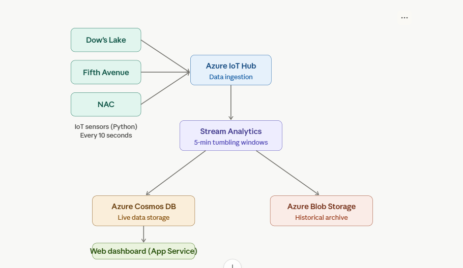
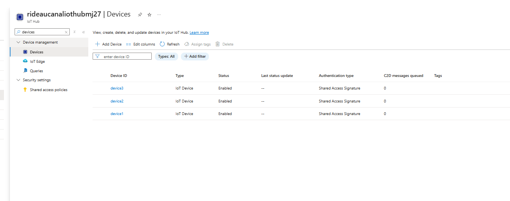
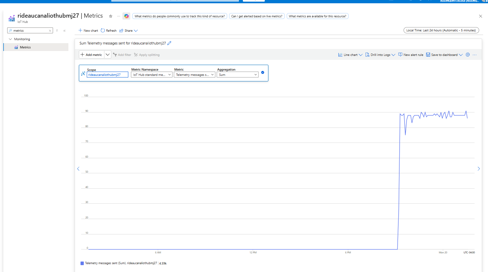
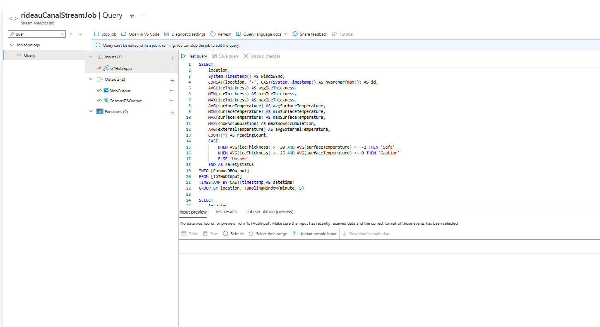
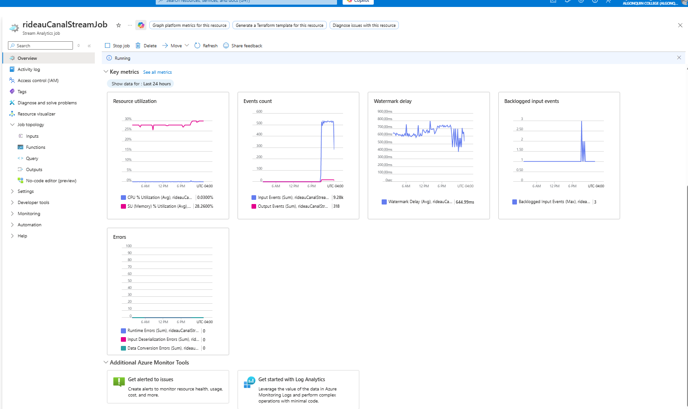
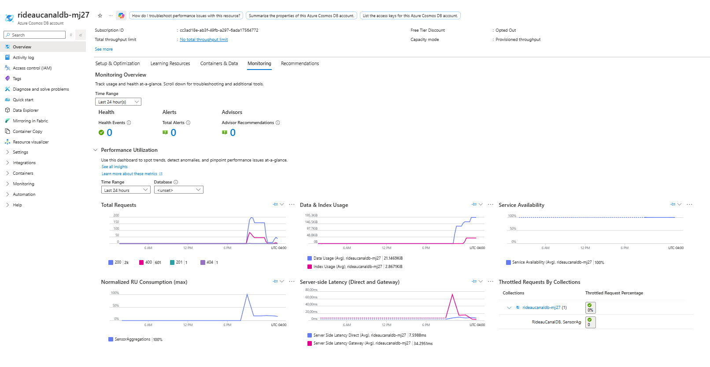
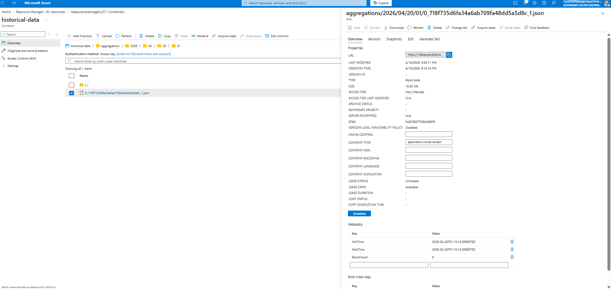
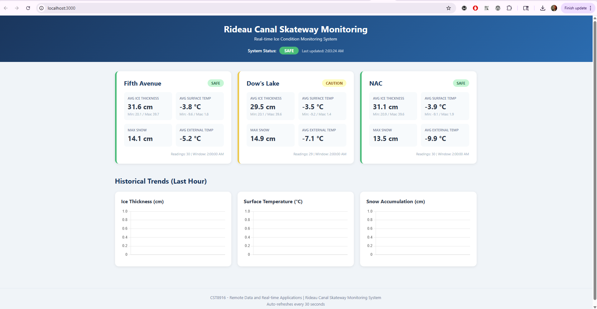
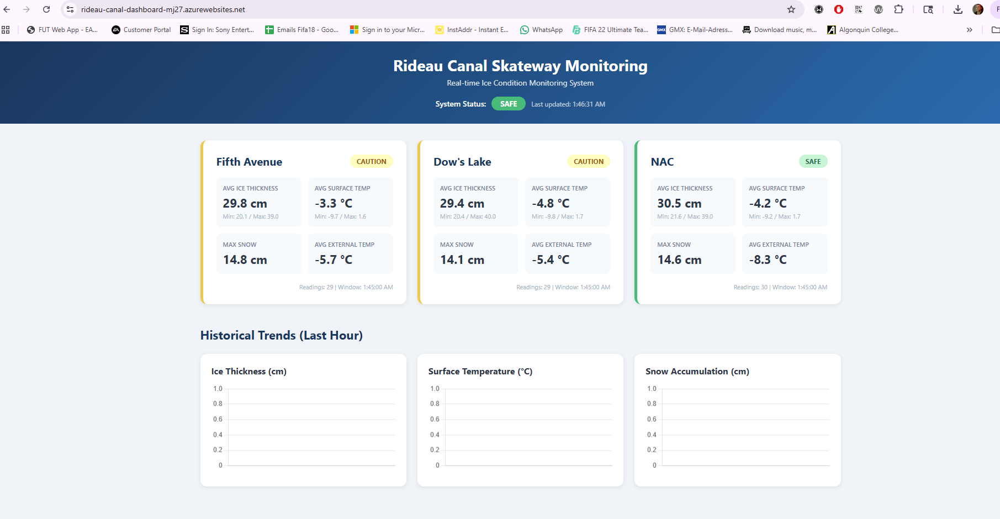

# Rideau Canal Skateway - Real-time Monitoring System

## CST8916 — Remote Data and Real-time Applications

**Student:** Muhannad J  
**Course:** CST8916 — Winter 2026  
**Professor:** Ramy Mohamed

## Project Overview

The Rideau Canal Skateway requires constant monitoring to ensure skater safety. This system simulates IoT sensors at three locations along the canal, processes the data in real-time, and displays live conditions through a web dashboard.

### Locations Monitored
- **Dow's Lake**
- **Fifth Avenue**
- **NAC (National Arts Centre)**

### Metrics Tracked
- Ice Thickness (cm)
- Surface Temperature (°C)
- Snow Accumulation (cm)
- External Temperature (°C)

## Repository Links

| Repository | Description |
|------------|-------------|
| [rideau-canal-monitoring](https://github.com/muhannadj27/rideau-canal-monitoring) | Main documentation (this repo) |
| [rideau-canal-sensor-simulation](https://github.com/muhannadj27/rideau-canal-sensor-simulation) | Python IoT sensor simulator |
| [rideau-canal-dashboard](https://github.com/muhannadj27/rideau-canal-dashboard) | Node.js web dashboard |

**Live Dashboard:** http://rideau-canal-dashboard-mj27.azurewebsites.net

## System Architecture



### Data Flow

1. **Python sensor simulator** sends JSON telemetry every 10 seconds to Azure IoT Hub for 3 locations
2. **Azure IoT Hub** ingests the data from all 3 simulated devices
3. **Azure Stream Analytics** processes data using 5-minute tumbling windows, calculating averages, min/max values, and safety status
4. Processed data is sent to two outputs:
   - **Azure Cosmos DB** — stores aggregated data for the live dashboard
   - **Azure Blob Storage** — archives historical data for long-term storage
5. **Node.js web dashboard** (hosted on Azure App Service) queries Cosmos DB and displays real-time conditions with auto-refresh every 30 seconds

## Azure Services Used

| Service | Purpose |
|---------|---------|
| Azure IoT Hub | Data ingestion from 3 simulated sensor devices |
| Azure Stream Analytics | Real-time processing with 5-minute tumbling windows |
| Azure Cosmos DB | NoSQL database for live dashboard queries |
| Azure Blob Storage | Historical data archival |
| Azure App Service | Web dashboard hosting |

## Implementation Overview

### IoT Sensor Simulation
- **Language:** Python
- **Frequency:** Every 10 seconds
- **Devices:** 3 (one per location)
- **SDK:** azure-iot-device
- **Repository:** [rideau-canal-sensor-simulation](https://github.com/muhannadj27/rideau-canal-sensor-simulation)

### Stream Analytics Query
The query uses 5-minute tumbling windows to aggregate sensor data and determine safety status:

```sql
SELECT
    location,
    System.Timestamp() AS windowend,
    CONCAT(location, '-', CAST(System.Timestamp() AS nvarchar(max))) AS id,
    AVG(iceThickness) AS avgicethickness,
    MIN(iceThickness) AS minicethickness,
    MAX(iceThickness) AS maxicethickness,
    AVG(surfaceTemperature) AS avgsurfacetemperature,
    MIN(surfaceTemperature) AS minsurfacetemperature,
    MAX(surfaceTemperature) AS maxsurfacetemperature,
    MAX(snowAccumulation) AS maxsnowaccumulation,
    AVG(externalTemperature) AS avgexternaltemperature,
    COUNT(*) AS readingcount,
    CASE
        WHEN AVG(iceThickness) >= 30 AND AVG(surfaceTemperature) <= -2 THEN 'Safe'
        WHEN AVG(iceThickness) >= 25 AND AVG(surfaceTemperature) <= 0 THEN 'Caution'
        ELSE 'Unsafe'
    END AS safetystatus
INTO [CosmosDBOutput]
FROM [IoTHubInput]
TIMESTAMP BY CAST(timestamp AS datetime)
GROUP BY location, TumblingWindow(minute, 5)
```

**Safety Status Logic:**
- **Safe:** Ice ≥ 30cm AND Surface Temp ≤ -2°C
- **Caution:** Ice ≥ 25cm AND Surface Temp ≤ 0°C
- **Unsafe:** All other conditions

### Cosmos DB Configuration
- **Database:** RideauCanalDB
- **Container:** SensorAggregations
- **Partition Key:** /location

### Blob Storage Configuration
- **Container:** historical-data
- **Path Pattern:** aggregations/{date}/{time}

### Web Dashboard
- **Backend:** Node.js with Express
- **Frontend:** HTML/CSS/JavaScript with Chart.js
- **Features:** Real-time data cards, safety badges, auto-refresh (30s), historical trend charts
- **Repository:** [rideau-canal-dashboard](https://github.com/muhannadj27/rideau-canal-dashboard)

## Screenshots

### IoT Hub — Registered Devices


### IoT Hub — Messages Received


### Stream Analytics — Query


### Stream Analytics — Running


### Cosmos DB — Data Explorer


### Blob Storage — Archived Files


### Dashboard — Running Locally


### Dashboard — Deployed on Azure


## Setup Instructions

### Prerequisites
- Azure subscription
- Python 3.10+
- Node.js 18+
- Azure CLI

### Quick Start
1. Set up Azure resources (IoT Hub, Stream Analytics, Cosmos DB, Blob Storage)
2. Clone and configure the [sensor simulator](https://github.com/muhannadj27/rideau-canal-sensor-simulation)
3. Start the Stream Analytics job
4. Run the sensor simulator for at least 30 minutes
5. Clone and configure the [dashboard](https://github.com/muhannadj27/rideau-canal-dashboard)
6. Deploy dashboard to Azure App Service

See individual repository READMEs for detailed instructions.

## Challenges and Solutions

1. **IoT Hub Daily Message Limit:** The free tier (F1) has a daily limit of ~8,000 messages. During long testing sessions, the simulator would get connection drops. Solution: Plan testing windows and restart the next day.

2. **Field Name Casing:** Stream Analytics outputs lowercase field names (e.g., `avgicethickness`) while the dashboard initially expected camelCase. Solution: Updated dashboard code to match the actual field names in Cosmos DB.

3. **Cosmos DB Region Support:** The `westus3` region initially had issues with Cosmos DB creation. Solution: Added the `failoverPriority=0` parameter to the CLI command.

## AI Tools Disclosure

### Tools Used
- **Claude (Anthropic):** Used for code generation, debugging, architecture guidance, and documentation writing
- **Purpose:** Generating boilerplate code for the sensor simulator and dashboard, troubleshooting Azure CLI errors, and creating documentation

### AI-Generated vs. Original Work
- The overall architecture design and Azure service configuration were done with AI guidance
- Python sensor simulator code was AI-generated and customized
- Node.js dashboard code was AI-generated and debugged to match actual Cosmos DB schema
- All Azure resource provisioning and deployment was performed manually
- Documentation was drafted with AI assistance

## References

- [Azure IoT Hub Documentation](https://docs.microsoft.com/en-us/azure/iot-hub/)
- [Azure Stream Analytics](https://docs.microsoft.com/en-us/azure/stream-analytics/)
- [Azure Cosmos DB](https://docs.microsoft.com/en-us/azure/cosmos-db/)
- [Chart.js](https://www.chartjs.org/)
- [Express.js](https://expressjs.com/)
